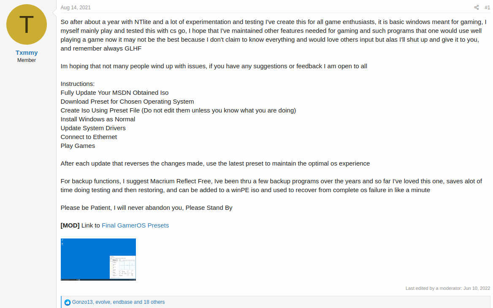
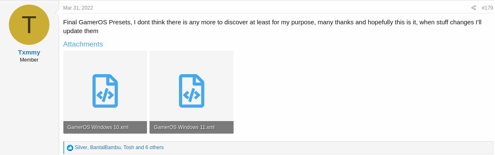
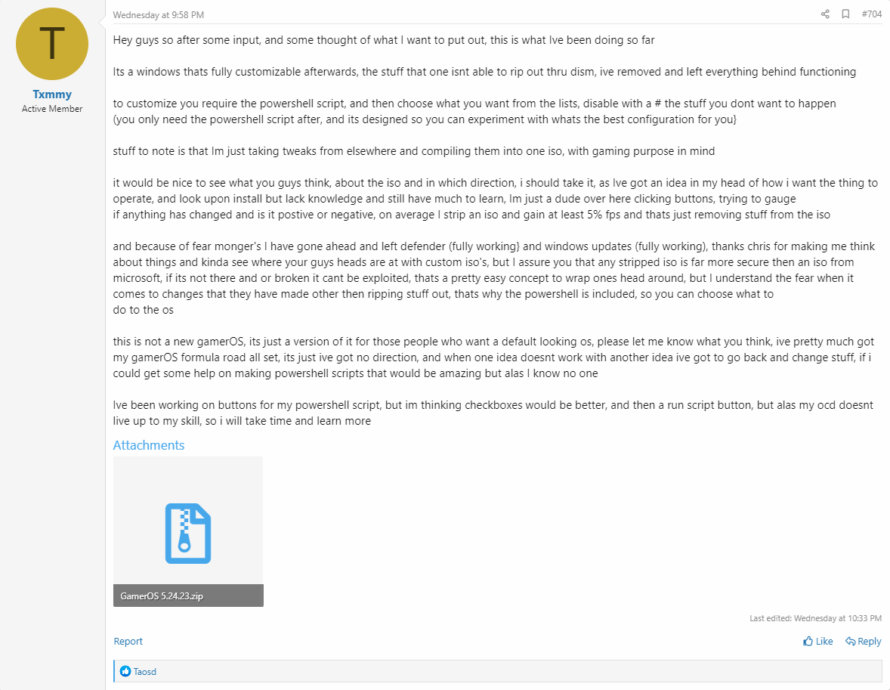

# NTLite GamerOS Configs for Windows 10 and 11

These config files were originally made by Txmmy @ <https://www.ntlite.com/community/index.php?threads/gameros-windows-10-11-diy-preset.2350/post-35750>

This repository is here to maintain, share, and improve his excellent work that he put months into.

## Todo

- [ ] windows non-automatic updates is annoying, set it back to default (auto I guess)
- [ ] file deletion popup is annoying, set it back to defaults (no popup for standard deletion & popup for shift+delete I guess)
- [ ] webcam is not working... ?
- [ ] expanded icons with labels in taskbar are annoying, set it back to default (collapsed/small I guess)
